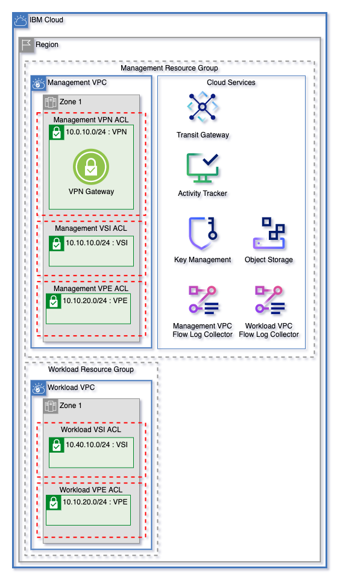

# ICSE Flexible Landing Zone Template

Get started on IBM Cloud with a flexible landing zone for VPC Networking, Clusters, Virtual Servers, and Cloud Services with minimal inputs. Easily grow from 1 to 3 zones and manage multiple worker pools.

 1 Zone   | 3 Zones
----------|------
 | 

---

## Table of Contents

1. [Quick Start Templates](#quick-start-templates)
    - [3 Zone Patterns](#3-zone-patterns)
       - [VSI Pattern](#vsi-pattern)
       - [OpenShift and VSI Pattern](#openshift-and-vsi-pattern)
    - [1 Zone Patterns](#1-zone-patterns)
       - [One VPC OpenShift Pattern](#one-vpc-openshift-pattern)
       - [One VPC Virtual Server Pattern](#one-vpc-virtual-server-pattern)
2. [Flexible VPC Network](#flexible-vpc-network)
    - [VPC Network Variables](#vpc-network-variables)
    - [Easily Expand Your Network](#easily-expand-your-architecturefrom-one-to-three-zones)
3. [Cloud Services](#cloud-services)
    - [Cloud Service Variables](#cloud-service-variables)
4. [VPC Clusters](#vpc-clusters)
    - [VPC Cluster Variables](#vpc-cluster-variables)
    - [Cluster Encryption Key](#cluster-encryption-key)
5. [Cluster Worker Pools](#cluster-worker-pools)
6. [Virtual Servers](#virtual-servers)
    - [Quick Start Virtual Servers](#quickstart-virtual-servers)
      - [Customizing Quick Start VSI Security Group Rules](#customizing-quick-start-vsi-security-groups)
    - [Custom Virtual Server Deployments](#custom-virtual-server-deployments)
7. [F5 BIG-IP and Edge VPC Network](#f5-big-ip-and-edge-vpc-network)
8. [Teleport Virtual Servers](#teleport-virtual-servers)
9. [Quickstart Variables](#quickstart-variables)
10. [Advanced Setup](#advanced-setup)
11. [Template Variables](#template-variables)
12. [Template Outputs](#template-outputs)

---

## Quick Start Templates

Get started with our quick start patterns by copying the pattern tfvars into `terraform.tfvars` inside the root directory.

### Clone the Repo

```shell
$ git clone https://github.com/Cloud-Schematics/icse-landing-zone.git
```

### Create Variable Store

```shell
$ cd icse-landing-zone/
$ touch terraform.tfvars
```
### Copy Example Variables

Choose a pattern and add the pattern `.tfvars` to `terraform.tfvars`. Fill in the following variables inside `terraform.tfvars`:

Variable Name    | Value
-----------------|---------
ibmcloud_api_key | Your IBM Cloud Platform API Key
region           | The IBM Cloud region to deploy your architecture
prefix           | A unique identifier that will be prepended to the name of each resource
ssh_public_key   | The SSH key to use when proisioning virtual servers *(Only required when provisioning VSI)*

---

## 3 Zone Patterns

### VSI Pattern

<table>
  <tr>
    <th>Network Architecture Diagram</th><th>Pattern .tfvars</th>
  </tr>
  <tr>
    <td> 
    
 

  </td>
    <td>


```terraform
ibmcloud_api_key = `"<your api key>"`
region           = `"<ibm cloud region>"`
prefix           = `"<your architecture prefix>"
ssh_public_key   = `"<your ssh public key>"`
tags             = ["icse", "landing-zone"]
zones            = 3
vsi_vpcs         = ["workload", "management"]
vsi_subnet_tier  = ["vsi"]
vsi_per_subnet   = 1
vsi_zones        = 3
image_name       = "ibm-ubuntu-18-04-6-minimal-amd64-3"
profile          = "bx2-2x8"
```

  </td>
  </tr>
</table>

### OpenShift and VSI Pattern

<table>
  <tr>
    <th>Network Architecture Diagram</th><th>Pattern .tfvars</th>
  </tr>
  <tr>
  <td> 
      
 
      
      
  </td>
    <td>


```terraform
ibmcloud_api_key    = `"<your api key>"`
region              = `"<ibm cloud region>"`
prefix              = `"<your architecture prefix>"`
ssh_public_key      = `"<your ssh public key>"`
tags                = ["icse", "landing-zone"]
zones               = 3
cluster_type        = "openshift"
cluster_vpcs        = ["workload"]
cluster_subnet_tier = ["vsi"]
cluster_zones       = 3
kube_version        = "default"
flavor              = "bx2.16x64"
workers_per_zone    = 2
entitlement         = null
vsi_vpcs            = ["management"]
vsi_subnet_tier     = ["vsi"]
vsi_per_subnet      = 1
vsi_zones           = 3
image_name          = "ibm-ubuntu-18-04-6-minimal-amd64-3"
profile             = "bx2-2x8"
disable_public_service_endpoint = false
```


  </td>
  </tr>
</table>

---

## 1 Zone Patterns

### One VPC OpenShift Pattern

<table>
  <tr>
    <th>Network Architecture Diagram</th><th>Pattern .tfvars</th>
  </tr>
  <tr>
  <td> 
      
 
      
      
  </td>
    <td>


```terraform
ibmcloud_api_key                         = `"<your api key>"`
region                                   = `"<ibm cloud region>"`
prefix                                   = `"<your architecture prefix>"`
tags                                     = ["icse", "landing-zone"]
zones                                    = 1
vpc_names                                = ["management"]
cluster_type                             = "openshift"
cluster_vpcs                             = ["management"]
cluster_subnet_tier                      = ["vsi"]
cluster_zones                            = 3
kube_version                             = "default"
flavor                                   = "bx2.16x64"
workers_per_zone                         = 2
entitlement                              = null
enable_transit_gateway                   = false
disable_public_service_endpoint          = false
vpcs_create_endpoint_gateway_on_vpe_tier = ["management"]
vsi_vpcs                                 = []
vsi_subnet_tier                          = []
```


  </td>
  </tr>
</table>

### One VPC Virtual Server Pattern

<table>
  <tr>
    <th>Network Architecture Diagram</th><th>Pattern .tfvars</th>
  </tr>
  <tr>
  <td> 
      
 
      
      
  </td>
    <td>


```terraform
ibmcloud_api_key                         = `"<your api key>"`
region                                   = `"<ibm cloud region>"`
prefix                                   = `"<your architecture prefix>"`
ssh_public_key                           = `"<your ssh public key>"`
tags                                     = ["icse", "landing-zone"]
zones                                    = 1
vpc_names                                = ["management"]
vsi_vpcs                                 = ["management"]
vsi_subnet_tier                          = ["vsi"]
vsi_per_subnet                           = 1
vsi_zones                                = 3
image_name                               = "ibm-ubuntu-18-04-6-minimal-amd64-3"
profile                                  = "bx2-2x8"
enable_transit_gateway                   = false
vpcs_create_endpoint_gateway_on_vpe_tier = ["management"]
```


  </td>
  </tr>
</table>

---

## Flexible VPC Network

This template uses the [ICSE Flexible VPC Network Template](https://github.com/Cloud-Schematics/easy-flexible-vpc-network) as a base to to create VPC Networking infrastucture. Read the full documentation [here](./.docs/network.md).

VPC Components managed by this template are:
- VPCs
- Subnets
- Network Access Control Lists
- Public Gateways (Optional)
- VPN Gateway (Optional)
- Transit Gateways & Gateway Connections (Optional)

---

### Easily expand your architecturefrom one to three zones

Dynamically increase zones by increasing the `zones` variables. Networks are configured to ensure that network addresses within this template won't overlap.

---

### VPC Network Variables

The following variables are used to configure the VPC Network:

Name                                | Type         | Description                                                                                                                                                                                                                           | Default
----------------------------------- | ------------ | ------------------------------------------------------------------------------------------------------------------------------------------------------------------------------------------------------------------------------------- | --------------------------
zones                               | number       | Number of zones for each VPC                                                                                                                                                                                                          | 3
vpc_names                           | list(string) | Names for VPCs to create. A resource group will be dynamically created for each VPC by default.                                                                                                                                       | ["management", "workload"]
existing_resource_groups            | list(string) | List of resource groups to use for infrastructire created. This value must be the same length as `vpc_names`. Each resource group will correspond directly to the same index as `vpc_names`. To create new resource groups, leave this variable as `[]`. Leave indexes as empty string to create new resource group. | []
vpc_subnet_tiers                    | list(string) | List of names for subnet tiers to add to each VPC. For each tier, a subnet will be created in each zone of each VPC. Each tier of subnet will have a unique access control list on each VPC.                                          | ["vsi", "vpe"]
vpc_subnet_tiers_add_public_gateway | list(string) | List of subnet tiers where a public gateway will be attached. Public gateways will be created in each VPC using these network tiers.                                                                                                  | ["vpn"]
vpcs_add_vpn_subnet                 | list(string) | List of VPCs to add a subnet and VPN gateway. VPCs must be defined in `var.vpc_names`. A subnet and address prefix will be added in zone 1 for the VPN Gateway.                                                                       | ["management"]
enable_transit_gateway              | bool         | Create transit gateway                                                                                                                                                                                                                | true
transit_gateway_connections         | list(string) | List of VPC names from `var.vpc_names` to connect via a single transit gateway. To not use transit gateway, provide an empty list.                                                                                                    | ["management", "workload"]

---

## Cloud Services

Cloud services are also managed using the ICSE Flexible VPC Network Template as a framework. Find the full documentation on the cloud service [here](./.docs/services.md).

Cloud Services that can be created by this template:

- Key Protect
- Encryption Keys (either in Key Protect or HyperProtect Crypto Services)
- Activity Tracker
- Cloud Object Storage & Object Storage Buckets
- Secrets Manager
- Virtual Private Endpoints for VPC
- Flow Log Collectors for VPC

---

### Cloud Service Variables

The following variables are used to create cloud services:

Name                                     | Type         | Description                                                                                                   | Default
---------------------------------------- | ------------ | ------------------------------------------------------------------------------------------------------------- | -------------------------------
existing_hs_crypto_name                  | string       | OPTIONAL - Get data for an existing HPCS instance. If you want a KMS instance to be created, leave as `null`. | null
existing_hs_crypto_resource_group        | string       | OPTIONAL - Resource group name for an existing HPCS instance. Use only with `existing_hs_crypto_name`.        | null
enable_atracker                          | bool         | Enable activity tracker for this pattern.                                                                     | true
add_atracker_route                       | bool         | Add a route to the Atracker instance.                                                                         | false
cos_use_random_suffix                    | bool         | Add a randomize suffix to the end of each Object Storage resource created in this module.                     | true
create_secrets_manager                   | bool         | Create a Secrets Manager service instance.                                                                    | false
enable_virtual_private_endpoints         | bool         | Enable virtual private endpoints.                                                                             | true
vpe_services                             | list(string) | List of VPE Services to use to create endpoint gateways.                                                      | ["cloud-object-storage", "kms"]
vpcs_create_endpoint_gateway_on_vpe_tier | list(string) | Create a Virtual Private Endpoint for supported services on each `vpe` tier of VPC names in this list.        | ["management", "workload"]

---

## VPC Clusters

This template allows users to create clusters on any number of subnet tiers in any number of VPCs. The number of zones can also be scaled dynamically. Users can choose to use either Red Hat OpenShift Clusters or IBM Cloud Kubernetes Service clusters. Clusters are created using the [ICSE VPC Cluster Module](https://github.com/Cloud-Schematics/icse-cluster-module).

OpenShift Clusters require at least 2 workers across any number of zones to be provisioned. Template will fail on plan if too few workers are provided.

---

### VPC Cluster Variables

Name                            | Type         | Description                                                                                                                                                                                                                                                                                                                                                                                                                                                                         | Default
------------------------------- | ------------ | ----------------------------------------------------------------------------------------------------------------------------------------------------------------------------------------------------------------------------------------------------------------------------------------------------------------------------------------------------------------------------------------------------------------------------------------------------------------------------------- | ------------
cluster_type                    | string       | Cluster type. Can be `iks` or `openshift`.                                                                                                                                                                                                                                                                                                                                                                                                                                          | openshift
cluster_vpcs                    | list(string) | List of VPCs where clusters will be deployed.                                                                                                                                                                                                                                                                                                                                                                                                                                       | ["workload"]
cluster_subnet_tier             | list(string) | List of subnet tiers where clusters will be provisioned. Clusters will be provisioned on this tier in each vpc listed in `cluster_vpcs` variable.                                                                                                                                                                                                                                                                                                                                   | ["vsi"]
cluster_zones                   | number       | Number of zones to provision clusters for each VPC. At least one zone is required. Can be 1, 2, or 3 zones.                                                                                                                                                                                                                                                                                                                                                                         | 3
kube_version                    | string       | Kubernetes version to use for cluster. To get available versions, use the IBM Cloud CLI command `ibmcloud ks versions`. To use the default version, leave as default. Updates to the default versions may force this to change.                                                                                                                                                                                                                                                     | default
flavor                          | string       | Machine type for cluster. Use the IBM Cloud CLI command `ibmcloud ks flavors` to find valid machine types                                                                                                                                                                                                                                                                                                                                                                           | bx2.16x64
workers_per_zone                | number       | Number of workers in each zone of the cluster. OpenShift requires at least 2 workers.                                                                                                                                                                                                                                                                                                                                                                                               | 2
wait_till                       | string       | To avoid long wait times when you run your Terraform code, you can specify the stage when you want Terraform to mark the cluster resource creation as completed. Depending on what stage you choose, the cluster creation might not be fully completed and continues to run in the background. However, your Terraform code can continue to run without waiting for the cluster to be fully created. Supported args are `MasterNodeReady`, `OneWorkerNodeReady`, and `IngressReady` | IngressReady
update_all_workers              | bool         | Update all workers to new kube version                                                                                                                                                                                                                                                                                                                                                                                                                                              | false
disable_public_service_endpoint | bool         | Disable the public service endpoint on the cluster.                                                                                                                                                                                                                                                                                                                                                                                                                                 | false
entitlement                     | string       | If you do not have an entitlement, leave as null. Entitlement reduces additional OCP Licence cost in OpenShift clusters. Use Cloud Pak with OCP Licence entitlement to create the OpenShift cluster. Note It is set only when the first time creation of the cluster, further modifications are not impacted Set this argument to cloud_pak only if you use the cluster with a Cloud Pak that has an OpenShift entitlement.                                                         | null

---

### Cluster Encryption Key

By default, the cluster creates a [Key Management Key](./clusters.tf#L61) in the Key Management service managed by this module to encrypt storage.

---

## Cluster Worker Pools

Cluster worker pools can be created and managed using this template. Worker pools can either be provisioned in each cluster, or managed at a detailed level by using [advanced setup](./.docs/advanced-setup.md). This template uses the [ICSE Cluster Worker Pool Module](github.com/Cloud-Schematics/icse-vpc-cluster-worker-pool-module) for worker pool creation.

To ensure that worker pools can be encrypted with an encryption key, a [service authorization](./cluster_worker_pools.tf#L6) is created to allow cluster permissions to read from the Key Management source.

---

### Quick Start Worker Pools

To add a worker pool with the same configuration as the cluster it's being attached to, add the worker pool name to the [worker_pool_names variable](./variables.tf#L367).

---

## Virtual Servers

This template allows users to create virtual deployments using two methods, quickstart virtual server deployments and custom virtual server deployments.

By default a [key management key](./virtual_servers.tf#L61) is created in the key management service and used to encrypt the boot volume of each virtual server.

Virtual server security groups support detailed security group variables, for more information see [advanced setup documentation](./.docs/advanced-setup.md#L52).

---

### Quickstart Virtual Servers

Quickstart Virtual servers allow for users to quicky create virtual server deployments and get started on IBM cloud. Quick start VSI are created using the [ICSE Virtual Server Deployment Module](https://github.com/Cloud-Schematics/icse-vsi-deployment). Each virtual server deployment will have it's own security group.

Quick start virtual server deployments can be found in [virtual_servers.tf](./virtual_servers.tf).

### Quickstart VSI Variables

Name                               | Type         | Description                                                                                                                                                                | Default
---------------------------------- | ------------ | -------------------------------------------------------------------------------------------------------------------------------------------------------------------------- | ----------------------------------
ssh_public_key                     | string       | SSH Public key to create. This SSH key will be used to create virtual servers. To use an existing key, leave as `null` and provide the key name to `use_ssh_key_data`.     | null
use_ssh_key_data                   | string       | (Optional) Name of an existing SSH key to get from data. To create a new key, leave this value as null. If a key name is provided here, no other ssh keys will be created. | null
vsi_vpcs                           | list(string) | List of VPCs where VSI will be deployed.                                                                                                                                   | ["workload"]
vsi_subnet_tier                    | list(string) | List of subnet tiers where VSI will be provisioned. Each tier on each VPC will be attached to it's own security group.                                                     | ["vsi"]
vsi_per_subnet                     | number       | Number of virtual servers to deploy on each subnet in each tier.                                                                                                           | 1
vsi_zones                          | number       | Number of zones to provision VSI for each VPC. At least one zone is required. Can be 1, 2, or 3 zones.                                                                     | 3
image_name                         | string       | Name of the image to use for VSI. Use the command `ibmcloud is images` to find availabled images in your region.                                                           | ibm-ubuntu-18-04-6-minimal-amd64-3
profile                            | string       | Type of machine profile for VSI. Use the command `ibmcloud is instance-profiles` to find available profiles in your region                                                 | bx2-2x8
quickstart_security_group_inbound_allow_list  | list(string) | List of CIDR blocks where inbound traffic will be allowed. These allow rules will be added to each VSI security group.                                          | [ "10.0.0.0/8", "161.26.0.0/16" ]
quickstart_security_group_outbound_allow_list | list(string) | List of CIDR blocks where outbound traffic will be allowed. These allow rules will be added to each VSI security group.                                         | [ "0.0.0.0/0" ]

---

## F5 BIG-IP and Edge VPC Network

An edge network and F5 BIG-IP virtual servers can optionally be added to a new `edge` VPC or on the management VPC:
- To create the network components on the management VPC for your landing zone deployment, set the `create_edge_network_on_management_vpc` variable to `true`
- To add a new VPC, set the `add_edge_vpc` variable to true. 

Variables for setup of F5 and the edge VPC network can be found in [variables.f5.tf](./variables.f5.tf).

To see the full documentation for f5 deployments, find the documentation [here](https://github.com/Cloud-Schematics/icse-f5-deployment-module)


---

## Teleport Virtual Servers

Optionally users can provision bastion servers with Teleport installed. This template uses the [ICSE Teleport Deployment Module](https://github.com/terraform-ibm-modules/terraform-teleport-deployment).

Users can provision bastion hosts on either the edge network bastion subnet tier, or on a specific VPC and Subnet tier.

Variables for the setup of teleport instances can be found in [variables.teleport.tf](./variables.teleport.tf). 

---

## Advanced Setup

Users can create detailed custom ACL rules, security group rules, security groups, and virtual server deployments. For more information, see the [Advanced Setup Documentation](./.docs/advanced-setup.md).

---

## Quickstart Variables

A template for using quickstart variables can be found in [example.tfvars](example.tfvars).

Name                                         | Type                                                                                                                                                                                                                                                                                                                                                                                                                                                                                                                                                                                                                                                                                                                                                                                                                                                                                                                                                                                                                                                                                                                                                                                                                                                                                                                                                                                                                                                                                                                                                                                                                                                                                                                                                      | Description                                                                                                                                                                                                                                                                                                                                                                                                                                                                         | Sensitive | Default
-------------------------------------------- | --------------------------------------------------------------------------------------------------------------------------------------------------------------------------------------------------------------------------------------------------------------------------------------------------------------------------------------------------------------------------------------------------------------------------------------------------------------------------------------------------------------------------------------------------------------------------------------------------------------------------------------------------------------------------------------------------------------------------------------------------------------------------------------------------------------------------------------------------------------------------------------------------------------------------------------------------------------------------------------------------------------------------------------------------------------------------------------------------------------------------------------------------------------------------------------------------------------------------------------------------------------------------------------------------------------------------------------------------------------------------------------------------------------------------------------------------------------------------------------------------------------------------------------------------------------------------------------------------------------------------------------------------------------------------------------------------------------------------------------------------------- | ----------------------------------------------------------------------------------------------------------------------------------------------------------------------------------------------------------------------------------------------------------------------------------------------------------------------------------------------------------------------------------------------------------------------------------------------------------------------------------- | --------- | ----------------------------------
ibmcloud_api_key                             | string                                                                                                                                                                                                                                                                                                                                                                                                                                                                                                                                                                                                                                                                                                                                                                                                                                                                                                                                                                                                                                                                                                                                                                                                                                                                                                                                                                                                                                                                                                                                                                                                                                                                                                                                                    | The IBM Cloud platform API key needed to deploy IAM enabled resources.                                                                                                                                                                                                                                                                                                                                                                                                              | true      | 
region                                       | string                                                                                                                                                                                                                                                                                                                                                                                                                                                                                                                                                                                                                                                                                                                                                                                                                                                                                                                                                                                                                                                                                                                                                                                                                                                                                                                                                                                                                                                                                                                                                                                                                                                                                                                                                    | The region to which to deploy the VPC                                                                                                                                                                                                                                                                                                                                                                                                                                               |           | 
prefix                                       | string                                                                                                                                                                                                                                                                                                                                                                                                                                                                                                                                                                                                                                                                                                                                                                                                                                                                                                                                                                                                                                                                                                                                                                                                                                                                                                                                                                                                                                                                                                                                                                                                                                                                                                                                                    | The prefix that you would like to prepend to your resources                                                                                                                                                                                                                                                                                                                                                                                                                         |           | 
tags                                         | list(string)                                                                                                                                                                                                                                                                                                                                                                                                                                                                                                                                                                                                                                                                                                                                                                                                                                                                                                                                                                                                                                                                                                                                                                                                                                                                                                                                                                                                                                                                                                                                                                                                                                                                                                                                              | List of Tags for the resource created                                                                                                                                                                                                                                                                                                                                                                                                                                               |           | null
zones                                        | number                                                                                                                                                                                                                                                                                                                                                                                                                                                                                                                                                                                                                                                                                                                                                                                                                                                                                                                                                                                                                                                                                                                                                                                                                                                                                                                                                                                                                                                                                                                                                                                                                                                                                                                                                    | Number of zones for each VPC                                                                                                                                                                                                                                                                                                                                                                                                                                                        |           | 3
vpc_names                                    | list(string)                                                                                                                                                                                                                                                                                                                                                                                                                                                                                                                                                                                                                                                                                                                                                                                                                                                                                                                                                                                                                                                                                                                                                                                                                                                                                                                                                                                                                                                                                                                                                                                                                                                                                                                                              | Names for VPCs to create. A resource group will be dynamically created for each VPC by default.                                                                                                                                                                                                                                                                                                                                                                                     |           | ["management", "workload"]
existing_resource_groups                     | list(string)                                                                                                                                                                                                                                                                                                                                                                                                                                                                                                                                                                                                                                                                                                                                                                                                                                                                                                                                                                                                                                                                                                                                                                                                                                                                                                                                                                                                                                                                                                                                                                                                                                                                                                                                              |  List of resource groups to use for infrastructire created. This value must be the same length as `vpc_names`. Each resource group will correspond directly to the same index as `vpc_names`. To create new resource groups, leave this variable as `[]`. Leave indexes as empty string to create new resource group.                                                                                                                                                                                                                                                                                                                                                                                                                                                                                   |           | []
vpc_subnet_tiers                             | list(string)                                                                                                                                                                                                                                                                                                                                                                                                                                                                                                                                                                                                                                                                                                                                                                                                                                                                                                                                                                                                                                                                                                                                                                                                                                                                                                                                                                                                                                                                                                                                                                                                                                                                                                                                              | List of names for subnet tiers to add to each VPC. For each tier, a subnet will be created in each zone of each VPC. Each tier of subnet will have a unique access control list on each VPC.                                                                                                                                                                                                                                                                                        |           | ["vsi", "vpe"]
vpc_subnet_tiers_add_public_gateway          | list(string)                                                                                                                                                                                                                                                                                                                                                                                                                                                                                                                                                                                                                                                                                                                                                                                                                                                                                                                                                                                                                                                                                                                                                                                                                                                                                                                                                                                                                                                                                                                                                                                                                                                                                                                                              | List of subnet tiers where a public gateway will be attached. Public gateways will be created in each VPC using these network tiers.                                                                                                                                                                                                                                                                                                                                                |           | ["vpn"]
vpcs_add_vpn_subnet                          | list(string)                                                                                                                                                                                                                                                                                                                                                                                                                                                                                                                                                                                                                                                                                                                                                                                                                                                                                                                                                                                                                                                                                                                                                                                                                                                                                                                                                                                                                                                                                                                                                                                                                                                                                                                                              | List of VPCs to add a subnet and VPN gateway. VPCs must be defined in `var.vpc_names`. A subnet and address prefix will be added in zone 1 for the VPN Gateway.                                                                                                                                                                                                                                                                                                                     |           | ["management"]
enable_transit_gateway                       | bool                                                                                                                                                                                                                                                                                                                                                                                                                                                                                                                                                                                                                                                                                                                                                                                                                                                                                                                                                                                                                                                                                                                                                                                                                                                                                                                                                                                                                                                                                                                                                                                                                                                                                                                                                      | Create transit gateway                                                                                                                                                                                                                                                                                                                                                                                                                                                              |           | true
transit_gateway_connections                  | list(string)                                                                                                                                                                                                                                                                                                                                                                                                                                                                                                                                                                                                                                                                                                                                                                                                                                                                                                                                                                                                                                                                                                                                                                                                                                                                                                                                                                                                                                                                                                                                                                                                                                                                                                                                              | List of VPC names from `var.vpc_names` to connect via a single transit gateway. To not use transit gateway, provide an empty list.                                                                                                                                                                                                                                                                                                                                                  |           | ["management", "workload"]
add_cluster_rules                            | bool                                                                                                                                                                                                                                                                                                                                                                                                                                                                                                                                                                                                                                                                                                                                                                                                                                                                                                                                                                                                                                                                                                                                                                                                                                                                                                                                                                                                                                                                                                                                                                                                                                                                                                                                                      | Automatically add needed ACL rules to allow each network to create and manage Openshift and IKS clusters.                                                                                                                                                                                                                                                                                                                                                                           |           | true
global_inbound_allow_list                    | list(string)                                                                                                                                                                                                                                                                                                                                                                                                                                                                                                                                                                                                                                                                                                                                                                                                                                                                                                                                                                                                                                                                                                                                                                                                                                                                                                                                                                                                                                                                                                                                                                                                                                                                                                                                              | List of CIDR blocks where inbound traffic will be allowed. These allow rules will be added to each network acl.                                                                                                                                                                                                                                                                                                                                                                     |           | [ "10.0.0.0/8", "161.26.0.0/16" ]
global_outbound_allow_list                   | list(string)                                                                                                                                                                                                                                                                                                                                                                                                                                                                                                                                                                                                                                                                                                                                                                                                                                                                                                                                                                                                                                                                                                                                                                                                                                                                                                                                                                                                                                                                                                                                                                                                                                                                                                                                              | List of CIDR blocks where outbound traffic will be allowed. These allow rules will be added to each network acl.                                                                                                                                                                                                                                                                                                                                                                    |           | [ "0.0.0.0/0" ]
global_inbound_deny_list                     | list(string)                                                                                                                                                                                                                                                                                                                                                                                                                                                                                                                                                                                                                                                                                                                                                                                                                                                                                                                                                                                                                                                                                                                                                                                                                                                                                                                                                                                                                                                                                                                                                                                                                                                                                                                                              | List of CIDR blocks where inbound traffic will be denied. These deny rules will be added to each network acl. Deny rules will be added after all allow rules.                                                                                                                                                                                                                                                                                                                       |           | [ "0.0.0.0/0" ]
global_outbound_deny_list                    | list(string)                                                                                                                                                                                                                                                                                                                                                                                                                                                                                                                                                                                                                                                                                                                                                                                                                                                                                                                                                                                                                                                                                                                                                                                                                                                                                                                                                                                                                                                                                                                                                                                                                                                                                                                                              | List of CIDR blocks where outbound traffic will be denied. These deny rules will be added to each network acl. Deny rules will be added after all allow rules.                                                                                                                                                                                                                                                                                                                      |           | []
existing_hs_crypto_name                      | string                                                                                                                                                                                                                                                                                                                                                                                                                                                                                                                                                                                                                                                                                                                                                                                                                                                                                                                                                                                                                                                                                                                                                                                                                                                                                                                                                                                                                                                                                                                                                                                                                                                                                                                                                    | OPTIONAL - Get data for an existing HPCS instance. If you want a KMS instance to be created, leave as `null`.                                                                                                                                                                                                                                                                                                                                                                       |           | null
existing_hs_crypto_resource_group            | string                                                                                                                                                                                                                                                                                                                                                                                                                                                                                                                                                                                                                                                                                                                                                                                                                                                                                                                                                                                                                                                                                                                                                                                                                                                                                                                                                                                                                                                                                                                                                                                                                                                                                                                                                    | OPTIONAL - Resource group name for an existing HPCS instance. Use only with `existing_hs_crypto_name`.                                                                                                                                                                                                                                                                                                                                                                              |           | null
enable_atracker                              | bool                                                                                                                                                                                                                                                                                                                                                                                                                                                                                                                                                                                                                                                                                                                                                                                                                                                                                                                                                                                                                                                                                                                                                                                                                                                                                                                                                                                                                                                                                                                                                                                                                                                                                                                                                      | Enable activity tracker for this pattern.                                                                                                                                                                                                                                                                                                                                                                                                                                           |           | true
add_atracker_route                           | bool                                                                                                                                                                                                                                                                                                                                                                                                                                                                                                                                                                                                                                                                                                                                                                                                                                                                                                                                                                                                                                                                                                                                                                                                                                                                                                                                                                                                                                                                                                                                                                                                                                                                                                                                                      | Add a route to the Atracker instance.                                                                                                                                                                                                                                                                                                                                                                                                                                               |           | false
cos_use_random_suffix                        | bool                                                                                                                                                                                                                                                                                                                                                                                                                                                                                                                                                                                                                                                                                                                                                                                                                                                                                                                                                                                                                                                                                                                                                                                                                                                                                                                                                                                                                                                                                                                                                                                                                                                                                                                                                      | Add a randomize suffix to the end of each Object Storage resource created in this module.                                                                                                                                                                                                                                                                                                                                                                                           |           | true
create_secrets_manager                       | bool                                                                                                                                                                                                                                                                                                                                                                                                                                                                                                                                                                                                                                                                                                                                                                                                                                                                                                                                                                                                                                                                                                                                                                                                                                                                                                                                                                                                                                                                                                                                                                                                                                                                                                                                                      | Create a Secrets Manager service instance.                                                                                                                                                                                                                                                                                                                                                                                                                                          |           | false
enable_virtual_private_endpoints             | bool                                                                                                                                                                                                                                                                                                                                                                                                                                                                                                                                                                                                                                                                                                                                                                                                                                                                                                                                                                                                                                                                                                                                                                                                                                                                                                                                                                                                                                                                                                                                                                                                                                                                                                                                                      | Enable virtual private endpoints.                                                                                                                                                                                                                                                                                                                                                                                                                                                   |           | true
vpe_services                                 | list(string)                                                                                                                                                                                                                                                                                                                                                                                                                                                                                                                                                                                                                                                                                                                                                                                                                                                                                                                                                                                                                                                                                                                                                                                                                                                                                                                                                                                                                                                                                                                                                                                                                                                                                                                                              | List of VPE Services to use to create endpoint gateways.                                                                                                                                                                                                                                                                                                                                                                                                                            |           | ["cloud-object-storage", "kms"]
vpcs_create_endpoint_gateway_on_vpe_tier     | list(string)                                                                                                                                                                                                                                                                                                                                                                                                                                                                                                                                                                                                                                                                                                                                                                                                                                                                                                                                                                                                                                                                                                                                                                                                                                                                                                                                                                                                                                                                                                                                                                                                                                                                                                                                              | Create a Virtual Private Endpoint for supported services on each `vpe` tier of VPC names in this list.                                                                                                                                                                                                                                                                                                                                                                              |           | ["management", "workload"]
cluster_type                                 | string                                                                                                                                                                                                                                                                                                                                                                                                                                                                                                                                                                                                                                                                                                                                                                                                                                                                                                                                                                                                                                                                                                                                                                                                                                                                                                                                                                                                                                                                                                                                                                                                                                                                                                                                                    | Cluster type. Can be `iks` or `openshift`.                                                                                                                                                                                                                                                                                                                                                                                                                                          |           | openshift
cluster_vpcs                                 | list(string)                                                                                                                                                                                                                                                                                                                                                                                                                                                                                                                                                                                                                                                                                                                                                                                                                                                                                                                                                                                                                                                                                                                                                                                                                                                                                                                                                                                                                                                                                                                                                                                                                                                                                                                                              | List of VPCs where clusters will be deployed.                                                                                                                                                                                                                                                                                                                                                                                                                                       |           | []
cluster_subnet_tier                          | list(string)                                                                                                                                                                                                                                                                                                                                                                                                                                                                                                                                                                                                                                                                                                                                                                                                                                                                                                                                                                                                                                                                                                                                                                                                                                                                                                                                                                                                                                                                                                                                                                                                                                                                                                                                              | List of subnet tiers where clusters will be provisioned.                                                                                                                                                                                                                                                                                                                                                                                                                            |           | []
cluster_zones                                | number                                                                                                                                                                                                                                                                                                                                                                                                                                                                                                                                                                                                                                                                                                                                                                                                                                                                                                                                                                                                                                                                                                                                                                                                                                                                                                                                                                                                                                                                                                                                                                                                                                                                                                                                                    | Number of zones to provision clusters for each VPC. At least one zone is required. Can be 1, 2, or 3 zones.                                                                                                                                                                                                                                                                                                                                                                         |           | 3
kube_version                                 | string                                                                                                                                                                                                                                                                                                                                                                                                                                                                                                                                                                                                                                                                                                                                                                                                                                                                                                                                                                                                                                                                                                                                                                                                                                                                                                                                                                                                                                                                                                                                                                                                                                                                                                                                                    | Kubernetes version to use for cluster. To get available versions, use the IBM Cloud CLI command `ibmcloud ks versions`. To use the default version, leave as default. Updates to the default versions may force this to change.                                                                                                                                                                                                                                                     |           | default
flavor                                       | string                                                                                                                                                                                                                                                                                                                                                                                                                                                                                                                                                                                                                                                                                                                                                                                                                                                                                                                                                                                                                                                                                                                                                                                                                                                                                                                                                                                                                                                                                                                                                                                                                                                                                                                                                    | Machine type for cluster. Use the IBM Cloud CLI command `ibmcloud ks flavors` to find valid machine types                                                                                                                                                                                                                                                                                                                                                                           |           | bx2.16x64
workers_per_zone                             | number                                                                                                                                                                                                                                                                                                                                                                                                                                                                                                                                                                                                                                                                                                                                                                                                                                                                                                                                                                                                                                                                                                                                                                                                                                                                                                                                                                                                                                                                                                                                                                                                                                                                                                                                                    | Number of workers in each zone of the cluster. OpenShift requires at least 2 workers.                                                                                                                                                                                                                                                                                                                                                                                               |           | 2
wait_till                                    | string                                                                                                                                                                                                                                                                                                                                                                                                                                                                                                                                                                                                                                                                                                                                                                                                                                                                                                                                                                                                                                                                                                                                                                                                                                                                                                                                                                                                                                                                                                                                                                                                                                                                                                                                                    | To avoid long wait times when you run your Terraform code, you can specify the stage when you want Terraform to mark the cluster resource creation as completed. Depending on what stage you choose, the cluster creation might not be fully completed and continues to run in the background. However, your Terraform code can continue to run without waiting for the cluster to be fully created. Supported args are `MasterNodeReady`, `OneWorkerNodeReady`, and `IngressReady` |           | IngressReady
update_all_workers                           | bool                                                                                                                                                                                                                                                                                                                                                                                                                                                                                                                                                                                                                                                                                                                                                                                                                                                                                                                                                                                                                                                                                                                                                                                                                                                                                                                                                                                                                                                                                                                                                                                                                                                                                                                                                      | Update all workers to new kube version                                                                                                                                                                                                                                                                                                                                                                                                                                              |           | false
disable_public_service_endpoint              | bool                                                                                                                                                                                                                                                                                                                                                                                                                                                                                                                                                                                                                                                                                                                                                                                                                                                                                                                                                                                                                                                                                                                                                                                                                                                                                                                                                                                                                                                                                                                                                                                                                                                                                                                                                      | Disable the public service endpoint on the cluster.                                                                                                                                                                                                                                                                                                                                                                                                                                 |           | false
entitlement                                  | string                                                                                                                                                                                                                                                                                                                                                                                                                                                                                                                                                                                                                                                                                                                                                                                                                                                                                                                                                                                                                                                                                                                                                                                                                                                                                                                                                                                                                                                                                                                                                                                                                                                                                                                                                    | If you do not have an entitlement, leave as null. Entitlement reduces additional OCP Licence cost in OpenShift clusters. Use Cloud Pak with OCP Licence entitlement to create the OpenShift cluster. Note It is set only when the first time creation of the cluster, further modifications are not impacted Set this argument to cloud_pak only if you use the cluster with a Cloud Pak that has an OpenShift entitlement.                                                         |           | null
worker_pool_names                            | list(string)                                                                                                                                                                                                                                                                                                                                                                                                                                                                                                                                                                                                                                                                                                                                                                                                                                                                                                                                                                                                                                                                                                                                                                                                                                                                                                                                                                                                                                                                                                                                                                                                                                                                                                                                              | Names of worker pools to add to the cluster. Worker pools added this way will be provisioned in the same zones, flavor, and entitlement as the parent cluster.                                                                                                                                                                                                                                                                                                                      |           | []
ssh_public_key                               | string                                                                                                                                                                                                                                                                                                                                                                                                                                                                                                                                                                                                                                                                                                                                                                                                                                                                                                                                                                                                                                                                                                                                                                                                                                                                                                                                                                                                                                                                                                                                                                                                                                                                                                                                                    | SSH Public key to create. This SSH key will be used to create virtual servers. To use an existing key, leave as `null` and provide the key name to `use_ssh_key_data`.                                                                                                                                                                                                                                                                                                              |           | null
use_ssh_key_data                             | string                                                                                                                                                                                                                                                                                                                                                                                                                                                                                                                                                                                                                                                                                                                                                                                                                                                                                                                                                                                                                                                                                                                                                                                                                                                                                                                                                                                                                                                                                                                                                                                                                                                                                                                                                    | (Optional) Name of an existing SSH key to get from data. To create a new key, leave this value as null. If a key name is provided here, no other ssh keys will be created.                                                                                                                                                                                                                                                                                                          |           | null
vsi_vpcs                                     | list(string)                                                                                                                                                                                                                                                                                                                                                                                                                                                                                                                                                                                                                                                                                                                                                                                                                                                                                                                                                                                                                                                                                                                                                                                                                                                                                                                                                                                                                                                                                                                                                                                                                                                                                                                                              | List of VPCs where VSI will be deployed.                                                                                                                                                                                                                                                                                                                                                                                                                                            |           | ["workload"]
vsi_subnet_tier                              | list(string)                                                                                                                                                                                                                                                                                                                                                                                                                                                                                                                                                                                                                                                                                                                                                                                                                                                                                                                                                                                                                                                                                                                                                                                                                                                                                                                                                                                                                                                                                                                                                                                                                                                                                                                                              | List of subnet tiers where VSI will be provisioned. Each tier on each VPC will be attached to it's own security group.                                                                                                                                                                                                                                                                                                                                                              |           | ["vsi"]
vsi_per_subnet                               | number                                                                                                                                                                                                                                                                                                                                                                                                                                                                                                                                                                                                                                                                                                                                                                                                                                                                                                                                                                                                                                                                                                                                                                                                                                                                                                                                                                                                                                                                                                                                                                                                                                                                                                                                                    | Number of virtual servers to deploy on each subnet in each tier.                                                                                                                                                                                                                                                                                                                                                                                                                    |           | 1
vsi_zones                                    | number                                                                                                                                                                                                                                                                                                                                                                                                                                                                                                                                                                                                                                                                                                                                                                                                                                                                                                                                                                                                                                                                                                                                                                                                                                                                                                                                                                                                                                                                                                                                                                                                                                                                                                                                                    | Number of zones to provision VSI for each VPC. At least one zone is required. Can be 1, 2, or 3 zones.                                                                                                                                                                                                                                                                                                                                                                              |           | 3
image_name                                   | string                                                                                                                                                                                                                                                                                                                                                                                                                                                                                                                                                                                                                                                                                                                                                                                                                                                                                                                                                                                                                                                                                                                                                                                                                                                                                                                                                                                                                                                                                                                                                                                                                                                                                                                                                    | Name of the image to use for VSI. Use the command `ibmcloud is images` to find availabled images in your region.                                                                                                                                                                                                                                                                                                                                                                    |           | ibm-ubuntu-18-04-6-minimal-amd64-3
profile                                      | string                                                                                                                                                                                                                                                                                                                                                                                                                                                                                                                                                                                                                                                                                                                                                                                                                                                                                                                                                                                                                                                                                                                                                                                                                                                                                                                                                                                                                                                                                                                                                                                                                                                                                                                                                    | Type of machine profile for VSI. Use the command `ibmcloud is instance-profiles` to find available profiles in your region                                                                                                                                                                                                                                                                                                                                                          |           | bx2-2x8
quickstart_security_group_inbound_allow_list | list(string)                                                                                                                                                                                                                                                                                                                                                                                                                                                                                                                                                                                                                                                                                                                                                                                                                                                                                                                                                                                                                                                                                                                                                                                                                                                                                                                                                                                                                                                                                                                                                                                                                                                                                                                                              | List of CIDR blocks where inbound traffic will be allowed. These allow rules will be added to each VSI security group.                                                                                                                                                                                                                                                                                                                                                              |           | [ "10.0.0.0/8", "161.26.0.0/16" ]
quickstart_security_group_outbound_allow_list| list(string)                                                                                                                                                                                                                                                                                                                                                                                                                                                                                                                                                                                                                                                                                                                                                                                                                                                                                                                                                                                                                                                                                                                                                                                                                                                                                                                                                                                                                                                                                                                                                                                                                                                                                                                                              | List of CIDR blocks where outbound traffic will be allowed. These allow rules will be added to each VSI security group.                                                                                                                                                                                                                                                                                                                                                             |           | [ "0.0.0.0/0" ]

---

## Template Variables

Name                                         | Type                                                                                                                                                                                                                                                                                                                                                                                                                                                                                                                                                                                                                                                                                                                                                                                                                                                                                                                                                                                                                                                                                                                                                                                                                                                                                                                                                                                                                                                                                                                                                                                                                                                                                                                                                      | Description                                                                                                                                                                                                                                                                                                                                                                                                                                                                         | Sensitive | Default
-------------------------------------------- | --------------------------------------------------------------------------------------------------------------------------------------------------------------------------------------------------------------------------------------------------------------------------------------------------------------------------------------------------------------------------------------------------------------------------------------------------------------------------------------------------------------------------------------------------------------------------------------------------------------------------------------------------------------------------------------------------------------------------------------------------------------------------------------------------------------------------------------------------------------------------------------------------------------------------------------------------------------------------------------------------------------------------------------------------------------------------------------------------------------------------------------------------------------------------------------------------------------------------------------------------------------------------------------------------------------------------------------------------------------------------------------------------------------------------------------------------------------------------------------------------------------------------------------------------------------------------------------------------------------------------------------------------------------------------------------------------------------------------------------------------------- | ----------------------------------------------------------------------------------------------------------------------------------------------------------------------------------------------------------------------------------------------------------------------------------------------------------------------------------------------------------------------------------------------------------------------------------------------------------------------------------- | --------- | ----------------------------------
ibmcloud_api_key                             | string                                                                                                                                                                                                                                                                                                                                                                                                                                                                                                                                                                                                                                                                                                                                                                                                                                                                                                                                                                                                                                                                                                                                                                                                                                                                                                                                                                                                                                                                                                                                                                                                                                                                                                                                                    | The IBM Cloud platform API key needed to deploy IAM enabled resources.                                                                                                                                                                                                                                                                                                                                                                                                              | true      | 
region                                       | string                                                                                                                                                                                                                                                                                                                                                                                                                                                                                                                                                                                                                                                                                                                                                                                                                                                                                                                                                                                                                                                                                                                                                                                                                                                                                                                                                                                                                                                                                                                                                                                                                                                                                                                                                    | The region to which to deploy the VPC                                                                                                                                                                                                                                                                                                                                                                                                                                               |           | 
prefix                                       | string                                                                                                                                                                                                                                                                                                                                                                                                                                                                                                                                                                                                                                                                                                                                                                                                                                                                                                                                                                                                                                                                                                                                                                                                                                                                                                                                                                                                                                                                                                                                                                                                                                                                                                                                                    | The prefix that you would like to prepend to your resources                                                                                                                                                                                                                                                                                                                                                                                                                         |           | 
tags                                         | list(string)                                                                                                                                                                                                                                                                                                                                                                                                                                                                                                                                                                                                                                                                                                                                                                                                                                                                                                                                                                                                                                                                                                                                                                                                                                                                                                                                                                                                                                                                                                                                                                                                                                                                                                                                              | List of Tags for the resource created                                                                                                                                                                                                                                                                                                                                                                                                                                               |           | null
zones                                        | number                                                                                                                                                                                                                                                                                                                                                                                                                                                                                                                                                                                                                                                                                                                                                                                                                                                                                                                                                                                                                                                                                                                                                                                                                                                                                                                                                                                                                                                                                                                                                                                                                                                                                                                                                    | Number of zones for each VPC                                                                                                                                                                                                                                                                                                                                                                                                                                                        |           | 3
vpc_names                                    | list(string)                                                                                                                                                                                                                                                                                                                                                                                                                                                                                                                                                                                                                                                                                                                                                                                                                                                                                                                                                                                                                                                                                                                                                                                                                                                                                                                                                                                                                                                                                                                                                                                                                                                                                                                                              | Names for VPCs to create. A resource group will be dynamically created for each VPC by default.                                                                                                                                                                                                                                                                                                                                                                                     |           | ["management", "workload"]
existing_resource_groups                     | list(string)                                                                                                                                                                                                                                                                                                                                                                                                                                                                                                                                                                                                                                                                                                                                                                                                                                                                                                                                                                                                                                                                                                                                                                                                                                                                                                                                                                                                                                                                                                                                                                                                                                                                                                                                              | List of resource groups to use for infrastructire created. This value must be the same length as `vpc_names`. Each resource group will correspond directly to the same index as `vpc_names`. To create new resource groups, leave this variable as `[]`. Leave indexes as empty string to create new resource group.                                                                                                                                                                                                                                                                                                                                                                                                                                                                                    |           | []
vpc_subnet_tiers                             | list(string)                                                                                                                                                                                                                                                                                                                                                                                                                                                                                                                                                                                                                                                                                                                                                                                                                                                                                                                                                                                                                                                                                                                                                                                                                                                                                                                                                                                                                                                                                                                                                                                                                                                                                                                                              | List of names for subnet tiers to add to each VPC. For each tier, a subnet will be created in each zone of each VPC. Each tier of subnet will have a unique access control list on each VPC.                                                                                                                                                                                                                                                                                        |           | ["vsi", "vpe"]
vpc_subnet_tiers_add_public_gateway          | list(string)                                                                                                                                                                                                                                                                                                                                                                                                                                                                                                                                                                                                                                                                                                                                                                                                                                                                                                                                                                                                                                                                                                                                                                                                                                                                                                                                                                                                                                                                                                                                                                                                                                                                                                                                              | List of subnet tiers where a public gateway will be attached. Public gateways will be created in each VPC using these network tiers.                                                                                                                                                                                                                                                                                                                                                |           | ["vpn"]
vpcs_add_vpn_subnet                          | list(string)                                                                                                                                                                                                                                                                                                                                                                                                                                                                                                                                                                                                                                                                                                                                                                                                                                                                                                                                                                                                                                                                                                                                                                                                                                                                                                                                                                                                                                                                                                                                                                                                                                                                                                                                              | List of VPCs to add a subnet and VPN gateway. VPCs must be defined in `var.vpc_names`. A subnet and address prefix will be added in zone 1 for the VPN Gateway.                                                                                                                                                                                                                                                                                                                     |           | ["management"]
enable_transit_gateway                       | bool                                                                                                                                                                                                                                                                                                                                                                                                                                                                                                                                                                                                                                                                                                                                                                                                                                                                                                                                                                                                                                                                                                                                                                                                                                                                                                                                                                                                                                                                                                                                                                                                                                                                                                                                                      | Create transit gateway                                                                                                                                                                                                                                                                                                                                                                                                                                                              |           | true
transit_gateway_connections                  | list(string)                                                                                                                                                                                                                                                                                                                                                                                                                                                                                                                                                                                                                                                                                                                                                                                                                                                                                                                                                                                                                                                                                                                                                                                                                                                                                                                                                                                                                                                                                                                                                                                                                                                                                                                                              | List of VPC names from `var.vpc_names` to connect via a single transit gateway. To not use transit gateway, provide an empty list.                                                                                                                                                                                                                                                                                                                                                  |           | ["management", "workload"]
add_cluster_rules                            | bool                                                                                                                                                                                                                                                                                                                                                                                                                                                                                                                                                                                                                                                                                                                                                                                                                                                                                                                                                                                                                                                                                                                                                                                                                                                                                                                                                                                                                                                                                                                                                                                                                                                                                                                                                      | Automatically add needed ACL rules to allow each network to create and manage Openshift and IKS clusters.                                                                                                                                                                                                                                                                                                                                                                           |           | true
global_inbound_allow_list                    | list(string)                                                                                                                                                                                                                                                                                                                                                                                                                                                                                                                                                                                                                                                                                                                                                                                                                                                                                                                                                                                                                                                                                                                                                                                                                                                                                                                                                                                                                                                                                                                                                                                                                                                                                                                                              | List of CIDR blocks where inbound traffic will be allowed. These allow rules will be added to each network acl.                                                                                                                                                                                                                                                                                                                                                                     |           | [ "10.0.0.0/8", "161.26.0.0/16" ]
global_outbound_allow_list                   | list(string)                                                                                                                                                                                                                                                                                                                                                                                                                                                                                                                                                                                                                                                                                                                                                                                                                                                                                                                                                                                                                                                                                                                                                                                                                                                                                                                                                                                                                                                                                                                                                                                                                                                                                                                                              | List of CIDR blocks where outbound traffic will be allowed. These allow rules will be added to each network acl.                                                                                                                                                                                                                                                                                                                                                                    |           | [ "0.0.0.0/0" ]
global_inbound_deny_list                     | list(string)                                                                                                                                                                                                                                                                                                                                                                                                                                                                                                                                                                                                                                                                                                                                                                                                                                                                                                                                                                                                                                                                                                                                                                                                                                                                                                                                                                                                                                                                                                                                                                                                                                                                                                                                              | List of CIDR blocks where inbound traffic will be denied. These deny rules will be added to each network acl. Deny rules will be added after all allow rules.                                                                                                                                                                                                                                                                                                                       |           | [ "0.0.0.0/0" ]
global_outbound_deny_list                    | list(string)                                                                                                                                                                                                                                                                                                                                                                                                                                                                                                                                                                                                                                                                                                                                                                                                                                                                                                                                                                                                                                                                                                                                                                                                                                                                                                                                                                                                                                                                                                                                                                                                                                                                                                                                              | List of CIDR blocks where outbound traffic will be denied. These deny rules will be added to each network acl. Deny rules will be added after all allow rules.                                                                                                                                                                                                                                                                                                                      |           | []
apply_new_rules_before_old_rules             | bool                                                                                                                                                                                                                                                                                                                                                                                                                                                                                                                                                                                                                                                                                                                                                                                                                                                                                                                                                                                                                                                                                                                                                                                                                                                                                                                                                                                                                                                                                                                                                                                                                                                                                                                                                      | When set to `true`, any new rules to be applied to existing Network ACLs will be added **before** existing rules and after any detailed rules that will be added. Otherwise, rules will be added after.                                                                                                                                                                                                                                                                             |           | true
deny_all_tcp_ports                           | list(number)                                                                                                                                                                                                                                                                                                                                                                                                                                                                                                                                                                                                                                                                                                                                                                                                                                                                                                                                                                                                                                                                                                                                                                                                                                                                                                                                                                                                                                                                                                                                                                                                                                                                                                                                              | Deny all inbound and outbound TCP traffic on each port in this list.                                                                                                                                                                                                                                                                                                                                                                                                                |           | []
deny_all_udp_ports                           | list(number)                                                                                                                                                                                                                                                                                                                                                                                                                                                                                                                                                                                                                                                                                                                                                                                                                                                                                                                                                                                                                                                                                                                                                                                                                                                                                                                                                                                                                                                                                                                                                                                                                                                                                                                                              | Deny all inbound and outbound UDP traffic on each port in this list.                                                                                                                                                                                                                                                                                                                                                                                                                |           | []
get_detailed_acl_rules_from_json             | bool                                                                                                                                                                                                                                                                                                                                                                                                                                                                                                                                                                                                                                                                                                                                                                                                                                                                                                                                                                                                                                                                                                                                                                                                                                                                                                                                                                                                                                                                                                                                                                                                                                                                                                                                                      | Decode local file `acl-rules.json` for the automated creation of Network ACL rules. If this is set to `false`, detailed_acl_rules will be used instead.                                                                                                                                                                                                                                                                                                                             |           | false
detailed_acl_rules                           | list( object({ acl_shortname = string rules = list( object({ shortname = string action = string direction = string add_first = optional(bool) destination = optional(string) source = optional(string) tcp = optional( object({ port_max = optional(number) port_min = optional(number) source_port_max = optional(number) source_port_min = optional(number) }) ) udp = optional( object({ port_max = optional(number) port_min = optional(number) source_port_max = optional(number) source_port_min = optional(number) }) ) icmp = optional( object({ type = optional(number) code = optional(number) }) ) }) ) }) )                                                                                                                                                                                                                                                                                                                                                                                                                                                                                                                                                                                                                                                                                                                                                                                                                                                                                                                                                                                                                                                                                                                                   | OPTIONAL - List describing network ACLs and rules to add.                                                                                                                                                                                                                                                                                                                                                                                                                           |           | []
existing_hs_crypto_name                      | string                                                                                                                                                                                                                                                                                                                                                                                                                                                                                                                                                                                                                                                                                                                                                                                                                                                                                                                                                                                                                                                                                                                                                                                                                                                                                                                                                                                                                                                                                                                                                                                                                                                                                                                                                    | OPTIONAL - Get data for an existing HPCS instance. If you want a KMS instance to be created, leave as `null`.                                                                                                                                                                                                                                                                                                                                                                       |           | null
existing_hs_crypto_resource_group            | string                                                                                                                                                                                                                                                                                                                                                                                                                                                                                                                                                                                                                                                                                                                                                                                                                                                                                                                                                                                                                                                                                                                                                                                                                                                                                                                                                                                                                                                                                                                                                                                                                                                                                                                                                    | OPTIONAL - Resource group name for an existing HPCS instance. Use only with `existing_hs_crypto_name`.                                                                                                                                                                                                                                                                                                                                                                              |           | null
enable_atracker                              | bool                                                                                                                                                                                                                                                                                                                                                                                                                                                                                                                                                                                                                                                                                                                                                                                                                                                                                                                                                                                                                                                                                                                                                                                                                                                                                                                                                                                                                                                                                                                                                                                                                                                                                                                                                      | Enable activity tracker for this pattern.                                                                                                                                                                                                                                                                                                                                                                                                                                           |           | true
add_atracker_route                           | bool                                                                                                                                                                                                                                                                                                                                                                                                                                                                                                                                                                                                                                                                                                                                                                                                                                                                                                                                                                                                                                                                                                                                                                                                                                                                                                                                                                                                                                                                                                                                                                                                                                                                                                                                                      | Add a route to the Atracker instance.                                                                                                                                                                                                                                                                                                                                                                                                                                               |           | false
cos_use_random_suffix                        | bool                                                                                                                                                                                                                                                                                                                                                                                                                                                                                                                                                                                                                                                                                                                                                                                                                                                                                                                                                                                                                                                                                                                                                                                                                                                                                                                                                                                                                                                                                                                                                                                                                                                                                                                                                      | Add a randomize suffix to the end of each Object Storage resource created in this module.                                                                                                                                                                                                                                                                                                                                                                                           |           | true
create_secrets_manager                       | bool                                                                                                                                                                                                                                                                                                                                                                                                                                                                                                                                                                                                                                                                                                                                                                                                                                                                                                                                                                                                                                                                                                                                                                                                                                                                                                                                                                                                                                                                                                                                                                                                                                                                                                                                                      | Create a Secrets Manager service instance.                                                                                                                                                                                                                                                                                                                                                                                                                                          |           | false
enable_virtual_private_endpoints             | bool                                                                                                                                                                                                                                                                                                                                                                                                                                                                                                                                                                                                                                                                                                                                                                                                                                                                                                                                                                                                                                                                                                                                                                                                                                                                                                                                                                                                                                                                                                                                                                                                                                                                                                                                                      | Enable virtual private endpoints.                                                                                                                                                                                                                                                                                                                                                                                                                                                   |           | true
vpe_services                                 | list(string)                                                                                                                                                                                                                                                                                                                                                                                                                                                                                                                                                                                                                                                                                                                                                                                                                                                                                                                                                                                                                                                                                                                                                                                                                                                                                                                                                                                                                                                                                                                                                                                                                                                                                                                                              | List of VPE Services to use to create endpoint gateways.                                                                                                                                                                                                                                                                                                                                                                                                                            |           | ["cloud-object-storage", "kms"]
vpcs_create_endpoint_gateway_on_vpe_tier     | list(string)                                                                                                                                                                                                                                                                                                                                                                                                                                                                                                                                                                                                                                                                                                                                                                                                                                                                                                                                                                                                                                                                                                                                                                                                                                                                                                                                                                                                                                                                                                                                                                                                                                                                                                                                              | Create a Virtual Private Endpoint for supported services on each `vpe` tier of VPC names in this list.                                                                                                                                                                                                                                                                                                                                                                              |           | ["management", "workload"]
cluster_type                                 | string                                                                                                                                                                                                                                                                                                                                                                                                                                                                                                                                                                                                                                                                                                                                                                                                                                                                                                                                                                                                                                                                                                                                                                                                                                                                                                                                                                                                                                                                                                                                                                                                                                                                                                                                                    | Cluster type. Can be `iks` or `openshift`.                                                                                                                                                                                                                                                                                                                                                                                                                                          |           | openshift
cluster_vpcs                                 | list(string)                                                                                                                                                                                                                                                                                                                                                                                                                                                                                                                                                                                                                                                                                                                                                                                                                                                                                                                                                                                                                                                                                                                                                                                                                                                                                                                                                                                                                                                                                                                                                                                                                                                                                                                                              | List of VPCs where clusters will be deployed.                                                                                                                                                                                                                                                                                                                                                                                                                                       |           | []
cluster_subnet_tier                          | list(string)                                                                                                                                                                                                                                                                                                                                                                                                                                                                                                                                                                                                                                                                                                                                                                                                                                                                                                                                                                                                                                                                                                                                                                                                                                                                                                                                                                                                                                                                                                                                                                                                                                                                                                                                              | List of subnet tiers where clusters will be provisioned.                                                                                                                                                                                                                                                                                                                                                                                                                            |           | []
cluster_zones                                | number                                                                                                                                                                                                                                                                                                                                                                                                                                                                                                                                                                                                                                                                                                                                                                                                                                                                                                                                                                                                                                                                                                                                                                                                                                                                                                                                                                                                                                                                                                                                                                                                                                                                                                                                                    | Number of zones to provision clusters for each VPC. At least one zone is required. Can be 1, 2, or 3 zones.                                                                                                                                                                                                                                                                                                                                                                         |           | 3
kube_version                                 | string                                                                                                                                                                                                                                                                                                                                                                                                                                                                                                                                                                                                                                                                                                                                                                                                                                                                                                                                                                                                                                                                                                                                                                                                                                                                                                                                                                                                                                                                                                                                                                                                                                                                                                                                                    | Kubernetes version to use for cluster. To get available versions, use the IBM Cloud CLI command `ibmcloud ks versions`. To use the default version, leave as default. Updates to the default versions may force this to change.                                                                                                                                                                                                                                                     |           | default
flavor                                       | string                                                                                                                                                                                                                                                                                                                                                                                                                                                                                                                                                                                                                                                                                                                                                                                                                                                                                                                                                                                                                                                                                                                                                                                                                                                                                                                                                                                                                                                                                                                                                                                                                                                                                                                                                    | Machine type for cluster. Use the IBM Cloud CLI command `ibmcloud ks flavors` to find valid machine types                                                                                                                                                                                                                                                                                                                                                                           |           | bx2.16x64
workers_per_zone                             | number                                                                                                                                                                                                                                                                                                                                                                                                                                                                                                                                                                                                                                                                                                                                                                                                                                                                                                                                                                                                                                                                                                                                                                                                                                                                                                                                                                                                                                                                                                                                                                                                                                                                                                                                                    | Number of workers in each zone of the cluster. OpenShift requires at least 2 workers.                                                                                                                                                                                                                                                                                                                                                                                               |           | 2
wait_till                                    | string                                                                                                                                                                                                                                                                                                                                                                                                                                                                                                                                                                                                                                                                                                                                                                                                                                                                                                                                                                                                                                                                                                                                                                                                                                                                                                                                                                                                                                                                                                                                                                                                                                                                                                                                                    | To avoid long wait times when you run your Terraform code, you can specify the stage when you want Terraform to mark the cluster resource creation as completed. Depending on what stage you choose, the cluster creation might not be fully completed and continues to run in the background. However, your Terraform code can continue to run without waiting for the cluster to be fully created. Supported args are `MasterNodeReady`, `OneWorkerNodeReady`, and `IngressReady` |           | IngressReady
update_all_workers                           | bool                                                                                                                                                                                                                                                                                                                                                                                                                                                                                                                                                                                                                                                                                                                                                                                                                                                                                                                                                                                                                                                                                                                                                                                                                                                                                                                                                                                                                                                                                                                                                                                                                                                                                                                                                      | Update all workers to new kube version                                                                                                                                                                                                                                                                                                                                                                                                                                              |           | false
disable_public_service_endpoint              | bool                                                                                                                                                                                                                                                                                                                                                                                                                                                                                                                                                                                                                                                                                                                                                                                                                                                                                                                                                                                                                                                                                                                                                                                                                                                                                                                                                                                                                                                                                                                                                                                                                                                                                                                                                      | Disable the public service endpoint on the cluster.                                                                                                                                                                                                                                                                                                                                                                                                                                 |           | false
entitlement                                  | string                                                                                                                                                                                                                                                                                                                                                                                                                                                                                                                                                                                                                                                                                                                                                                                                                                                                                                                                                                                                                                                                                                                                                                                                                                                                                                                                                                                                                                                                                                                                                                                                                                                                                                                                                    | If you do not have an entitlement, leave as null. Entitlement reduces additional OCP Licence cost in OpenShift clusters. Use Cloud Pak with OCP Licence entitlement to create the OpenShift cluster. Note It is set only when the first time creation of the cluster, further modifications are not impacted Set this argument to cloud_pak only if you use the cluster with a Cloud Pak that has an OpenShift entitlement.                                                         |           | null
worker_pool_names                            | list(string)                                                                                                                                                                                                                                                                                                                                                                                                                                                                                                                                                                                                                                                                                                                                                                                                                                                                                                                                                                                                                                                                                                                                                                                                                                                                                                                                                                                                                                                                                                                                                                                                                                                                                                                                              | Names of worker pools to add to the cluster. Worker pools added this way will be provisioned in the same zones, flavor, and entitlement as the parent cluster.                                                                                                                                                                                                                                                                                                                      |           | []
use_worker_pool_json                         | bool                                                                                                                                                                                                                                                                                                                                                                                                                                                                                                                                                                                                                                                                                                                                                                                                                                                                                                                                                                                                                                                                                                                                                                                                                                                                                                                                                                                                                                                                                                                                                                                                                                                                                                                                                      | Use detailed JSON information for the creation of worker pools from JSON. Conflicts with `detailed_worker_pools`.                                                                                                                                                                                                                                                                                                                                                                   |           | false
detailed_worker_pools                        | list( object({ pool_name = string cluster_vpc = string resource_group_id = optional(string) flavor = optional(string) workers_per_zone = optional(number) encryption_key_id = optional(string) kms_instance_guid = optional(string) }) )                                                                                                                                                                                                                                                                                                                                                                                                                                                                                                                                                                                                                                                                                                                                                                                                                                                                                                                                                                                                                                                                                                                                                                                                                                                                                                                                                                                                                                                                                                                  | OPTIONAL - Detailed worker pool configruation. Conflicts with `use_worker_pool_json`.                                                                                                                                                                                                                                                                                                                                                                                               |           | []
ssh_public_key                               | string                                                                                                                                                                                                                                                                                                                                                                                                                                                                                                                                                                                                                                                                                                                                                                                                                                                                                                                                                                                                                                                                                                                                                                                                                                                                                                                                                                                                                                                                                                                                                                                                                                                                                                                                                    | SSH Public key to create. This SSH key will be used to create virtual servers. To use an existing key, leave as `null` and provide the key name to `use_ssh_key_data`.                                                                                                                                                                                                                                                                                                              |           | null
use_ssh_key_data                             | string                                                                                                                                                                                                                                                                                                                                                                                                                                                                                                                                                                                                                                                                                                                                                                                                                                                                                                                                                                                                                                                                                                                                                                                                                                                                                                                                                                                                                                                                                                                                                                                                                                                                                                                                                    | (Optional) Name of an existing SSH key to get from data. To create a new key, leave this value as null. If a key name is provided here, no other ssh keys will be created.                                                                                                                                                                                                                                                                                                          |           | null
vsi_vpcs                                     | list(string)                                                                                                                                                                                                                                                                                                                                                                                                                                                                                                                                                                                                                                                                                                                                                                                                                                                                                                                                                                                                                                                                                                                                                                                                                                                                                                                                                                                                                                                                                                                                                                                                                                                                                                                                              | List of VPCs where VSI will be deployed.                                                                                                                                                                                                                                                                                                                                                                                                                                            |           | ["workload"]
vsi_subnet_tier                              | list(string)                                                                                                                                                                                                                                                                                                                                                                                                                                                                                                                                                                                                                                                                                                                                                                                                                                                                                                                                                                                                                                                                                                                                                                                                                                                                                                                                                                                                                                                                                                                                                                                                                                                                                                                                              | List of subnet tiers where VSI will be provisioned. Each tier on each VPC will be attached to it's own security group.                                                                                                                                                                                                                                                                                                                                                              |           | ["vsi"]
vsi_per_subnet                               | number                                                                                                                                                                                                                                                                                                                                                                                                                                                                                                                                                                                                                                                                                                                                                                                                                                                                                                                                                                                                                                                                                                                                                                                                                                                                                                                                                                                                                                                                                                                                                                                                                                                                                                                                                    | Number of virtual servers to deploy on each subnet in each tier.                                                                                                                                                                                                                                                                                                                                                                                                                    |           | 1
vsi_zones                                    | number                                                                                                                                                                                                                                                                                                                                                                                                                                                                                                                                                                                                                                                                                                                                                                                                                                                                                                                                                                                                                                                                                                                                                                                                                                                                                                                                                                                                                                                                                                                                                                                                                                                                                                                                                    | Number of zones to provision VSI for each VPC. At least one zone is required. Can be 1, 2, or 3 zones.                                                                                                                                                                                                                                                                                                                                                                              |           | 3
image_name                                   | string                                                                                                                                                                                                                                                                                                                                                                                                                                                                                                                                                                                                                                                                                                                                                                                                                                                                                                                                                                                                                                                                                                                                                                                                                                                                                                                                                                                                                                                                                                                                                                                                                                                                                                                                                    | Name of the image to use for VSI. Use the command `ibmcloud is images` to find availabled images in your region.                                                                                                                                                                                                                                                                                                                                                                    |           | ibm-ubuntu-18-04-6-minimal-amd64-3
profile                                      | string                                                                                                                                                                                                                                                                                                                                                                                                                                                                                                                                                                                                                                                                                                                                                                                                                                                                                                                                                                                                                                                                                                                                                                                                                                                                                                                                                                                                                                                                                                                                                                                                                                                                                                                                                    | Type of machine profile for VSI. Use the command `ibmcloud is instance-profiles` to find available profiles in your region                                                                                                                                                                                                                                                                                                                                                          |           | bx2-2x8
quickstart_security_group_inbound_allow_list            | list(string)                                                                                                                                                                                                                                                                                                                                                                                                                                                                                                                                                                                                                                                                                                                                                                                                                                                                                                                                                                                                                                                                                                                                                                                                                                                                                                                                                                                                                                                                                                                                                                                                                                                                                                                                              | List of CIDR blocks where inbound traffic will be allowed. These allow rules will be added to each VSI security group.                                                                                                                                                                                                                                                                                                                                                              |           | [ "10.0.0.0/8", "161.26.0.0/16" ]
quickstart_security_group_outbound_allow_list           | list(string)                                                                                                                                                                                                                                                                                                                                                                                                                                                                                                                                                                                                                                                                                                                                                                                                                                                                                                                                                                                                                                                                                                                                                                                                                                                                                                                                                                                                                                                                                                                                                                                                                                                                                                                                              | List of CIDR blocks where outbound traffic will be allowed. These allow rules will be added to each VSI security group.                                                                                                                                                                                                                                                                                                                                                             |           | [ "0.0.0.0/0" ]
use_quickstart_vsi_security_group_rules_json | bool                                                                                                                                                                                                                                                                                                                                                                                                                                                                                                                                                                                                                                                                                                                                                                                                                                                                                                                                                                                                                                                                                                                                                                                                                                                                                                                                                                                                                                                                                                                                                                                                                                                                                                                                                      | Get JSON data from `template-quickstart-security-group-rules.json` and add to security groups. Conflicts with `quickstart_vsi_detailed_security_group_rules`.                                                                                                                                                                                                                                                                                                                       |           | false
quickstart_vsi_detailed_security_group_rules | list( object({ security_group_shortname = string rules = list( object({ name = string direction = string remote = string tcp = optional( object({ port_max = optional(number) port_min = optional(number) }) ) udp = optional( object({ port_max = optional(number) port_min = optional(number) }) ) icmp = optional( object({ type = optional(number) code = optional(number) }) ) }) ) }) )                                                                                                                                                                                                                                                                                                                                                                                                                                                                                                                                                                                                                                                                                                                                                                                                                                                                                                                                                                                                                                                                                                                                                                                                                                                                                                                                                             | Manage additional security group rules on quickstart VSI deployments. Conflicts with `use_quickstart_vsi_security_group_rules_json`.                                                                                                                                                                                                                                                                                                                                                |           | []
use_security_group_json                      | bool                                                                                                                                                                                                                                                                                                                                                                                                                                                                                                                                                                                                                                                                                                                                                                                                                                                                                                                                                                                                                                                                                                                                                                                                                                                                                                                                                                                                                                                                                                                                                                                                                                                                                                                                                      | Use JSON to create additional security groups. If true, groups in `var.security_groups` will not be created.                                                                                                                                                                                                                                                                                                                                                                        |           | false
security_groups                              | list( object({ vpc_name = string name = string resource_group_id = optional(string) rules = list( object({ name = string direction = string remote = string tcp = optional( object({ port_max = optional(number) port_min = optional(number) }) ) udp = optional( object({ port_max = optional(number) port_min = optional(number) }) ) icmp = optional( object({ type = optional(number) code = optional(number) }) ) }) ) }) )                                                                                                                                                                                                                                                                                                                                                                                                                                                                                                                                                                                                                                                                                                                                                                                                                                                                                                                                                                                                                                                                                                                                                                                                                                                                                                                          | List of security groups to create.                                                                                                                                                                                                                                                                                                                                                                                                                                                  |           | []
use_detailed_vsi_deployment_json             | bool                                                                                                                                                                                                                                                                                                                                                                                                                                                                                                                                                                                                                                                                                                                                                                                                                                                                                                                                                                                                                                                                                                                                                                                                                                                                                                                                                                                                                                                                                                                                                                                                                                                                                                                                                      | Use detailed JSON information for the creation of VSI deployments from JSON. If true, will not use `detailed_vsi_deployments`.                                                                                                                                                                                                                                                                                                                                                      |           | false
detailed_vsi_deployments                     | list( object({ deployment_name = string image_name = string vsi_per_subnet = number profile = string vpc_name = string zones = number subnet_tiers = list(string) ssh_key_ids = list(string) resource_group_id = optional(string) primary_security_group_ids = optional(list(string)) secondary_subnet_tiers = optional(list(string)) boot_volume_encryption_key = optional(string) user_data = optional(string) allow_ip_spoofing = optional(bool) add_floating_ip = optional(bool) secondary_floating_ips = optional(list(string)) availability_policy_host_failure = optional(string) boot_volume_name = optional(string) boot_volume_size = optional(number) dedicated_host = optional(string) metadata_service_enabled = optional(bool) placement_group = optional(string) default_trusted_profile_target = optional(string) dedicated_host_group = optional(string) block_storage_volumes = optional( list( object({ name = string profile = string capacity = optional(number) iops = optional(number) encryption_key = optional(string) delete_all_snapshots = optional(bool) }) ) ) create_public_load_balancer = optional(bool) create_private_load_balancer = optional(bool) load_balancer_security_group_ids = optional(list(string)) pool_algorithm = optional(string) pool_protocol = optional(string) pool_health_delay = optional(number) pool_health_retries = optional(number) pool_health_timeout = optional(number) pool_health_type = optional(string) pool_member_port = optional(number) listener_port = optional(number) listener_protocol = optional(string) listener_connection_limit = optional(number) primary_security_group_names = optional(list(string)) load_balancer_security_group_names = optional(list(string)) }) ) | OPTIONAL - Detailed list of virtual server deployments.                                                                                                                                                                                                                                                                                                                                                                                                                             |           | []
add_edge_vpc                                 | bool                         | Create an edge VPC network and resource group. Conflicts with `create_edge_network_on_management_vpc`.                                                                                                       |           | true
create_edge_network_on_management_vpc        | bool                         | Create edge network components on management VPC and in management resource group. Conflicts with `add_edge_vpc`.                                                                                            |           | false
f5_create_vpn_1_subnet_tier                  | bool                         | Create VPN-1 subnet tier.                                                                                                                                                                                    |           | true
f5_create_vpn_2_subnet_tier                  | bool                         | Create VPN-1 subnet tier.                                                                                                                                                                                    |           | true
f5_bastion_subnet_zones                      | number                       | Create Bastion subnet tier for each zone in this list. Bastion subnets created cannot exceed number of zones in `var.zones`. These subnets are reserved for future bastion VSI deployment.                   |           | 1
f5_create_vpe_subnet_tier                    | bool                         | Create VPE subnet tier on edge VPC. Will be automatically disabled for edge deployments on the management network.                                                                                           |           | true
vpn_firewall_type                            | string                       | F5 deployment type if provisioning edge VPC. Can be `full-tunnel`, `waf`, or `vpn-and-waf`.                                                                                                                  |           | full-tunnel
f5_image_name                                | string                       | Image name for f5 deployments. Must be null or one of `f5-bigip-15-1-5-1-0-0-14-all-1slot`,`f5-bigip-15-1-5-1-0-0-14-ltm-1slot`, `f5-bigip-16-1-2-2-0-0-28-ltm-1slot`,`f5-bigip-16-1-2-2-0-0-28-all-1slot`]. |           | f5-bigip-16-1-2-2-0-0-28-all-1slot
f5_instance_profile                          | string                       | F5 vsi instance profile. Use the IBM Cloud CLI command `ibmcloud is instance-profiles` to see available image profiles.                                                                                      |           | cx2-4x8
workload_cidr_blocks                         | list(string)                 | List of workload CIDR blocks. This is used to create security group rules for the F5 management interface. |  | []
hostname                                     | string                       | The F5 BIG-IP hostname                                                                                                                                                                                       |           | f5-ve-01
domain                                       | string                       | The F5 BIG-IP domain name                                                                                                                                                                                    |           | local
default_route_interface                      | string                       | The F5 BIG-IP interface name for the default route. Leave null to auto assign.                                                                                                                               |           | null
tmos_admin_password                          | string                       | admin account password for the F5 BIG-IP instance                                                                                                                                                            | true      | null
license_type                                 | string                       | How to license, may be 'none','byol','regkeypool','utilitypool'                                                                                                                                              |           | none
byol_license_basekey                         | string                       | Bring your own license registration key for the F5 BIG-IP instance                                                                                                                                           |           | null
license_host                                 | string                       | BIGIQ IP or hostname to use for pool based licensing of the F5 BIG-IP instance                                                                                                                               |           | null
license_username                             | string                       | BIGIQ username to use for the pool based licensing of the F5 BIG-IP instance                                                                                                                                 |           | null
license_password                             | string                       | BIGIQ password to use for the pool based licensing of the F5 BIG-IP instance                                                                                                                                 |           | null
license_pool                                 | string                       | BIGIQ license pool name of the pool based licensing of the F5 BIG-IP instance                                                                                                                                |           | null
license_sku_keyword_1                        | string                       | BIGIQ primary SKU for ELA utility licensing of the F5 BIG-IP instance                                                                                                                                        |           | null
license_sku_keyword_2                        | string                       | BIGIQ secondary SKU for ELA utility licensing of the F5 BIG-IP instance                                                                                                                                      |           | null
license_unit_of_measure                      | string                       | BIGIQ utility pool unit of measurement                                                                                                                                                                       |           | hourly
do_declaration_url                           | string                       | URL to fetch the f5-declarative-onboarding declaration                                                                                                                                                       |           | null
as3_declaration_url                          | string                       | URL to fetch the f5-appsvcs-extension declaration                                                                                                                                                            |           | null
ts_declaration_url                           | string                       | URL to fetch the f5-telemetry-streaming declaration                                                                                                                                                          |           | null
phone_home_url                               | string                       | The URL to POST status when BIG-IP is finished onboarding                                                                                                                                                    |           | null
template_source                              | string                       | The terraform template source for phone_home_url_metadata                                                                                                                                                    |           | f5devcentral/ibmcloud_schematics_bigip_multinic_declared
template_version                             | string                       | The terraform template version for phone_home_url_metadata                                                                                                                                                   |           | 20210201
app_id                                       | string                       | The terraform application id for phone_home_url_metadata                                                                                                                                                     |           | null
tgactive_url                                 | string                       | The URL to POST L3 addresses when tgactive is triggered                                                                                                                                                      |           | 
tgstandby_url                                | string                       | The URL to POST L3 addresses when tgstandby is triggered                                                                                                                                                     |           | null
tgrefresh_url                                | string                       | The URL to POST L3 addresses when tgrefresh is triggered                                                                                                                                                     |           | null
enable_f5_management_fip                     | bool                         | Enable F5 management interface floating IP. Conflicts with `enable_f5_external_fip`, VSI can only have one floating IP per instance.                                                                         |           | false
enable_f5_external_fip                       | bool                         | Enable F5 external interface floating IP. Conflicts with `enable_f5_management_fip`, VSI can only have one floating IP per instance.                                                                         |           | false
enable_teleport                  | bool                                                    | Enable teleport VSI                                                                                                                              |           | true
use_f5_bastion_subnets           | bool                                                    | Create teleport instances on the edge network subnets reserved for bastion hosts. Instances will only be created if `enable_teleport` is `true`. |           | true
teleport_vpc                     | string                                                  | Shortname of the VPC where teleport VSI will be provisioned. This value is ignored when `use_f5_bastion_subnets` is true.                        |           | management
teleport_deployment_tier         | string                                                  | Subnet tier where teleport VSI will be deployed. This value is ignored when `use_f5_bastion_subnets` is true.                                    |           | vsi
teleport_zones                   | number                                                  | Number of zones where teleport VSI will be provisioned. This value is ignored when `use_f5_bastion_subnets` is `true`.                           |           | 1
appid_use_data                   | bool                                                    | Get App ID information from data.                                                                                                                |           | false
appid_name                       | string                                                  | App ID name. Use only if `use_data` is true.                                                                                                     |           | null
appid_resource_group_id          | string                                                  | App ID resource group. Use only if `use_data` is true.                                                                                           |           | null
teleport_profile                 | string                                                  | Machine type for Teleport VSI instances. Use the IBM Cloud CLI command `ibmcloud is instance-profiles` to see available image profiles.          |           | cx2-4x8
teleport_image_name              | string                                                  | Teleport VSI image name. Use the IBM Cloud CLI command `ibmcloud is images` to see availabled images.                                            |           | ibm-ubuntu-18-04-6-minimal-amd64-2
teleport_add_floating_ip         | bool                                                    | Add a floating IP to the primary network interface for each server in the deployment.                                                            |           | false
teleport_allow_tcp_ports_inbound | list(number)                                            | List of TCP ports where all inbound traffic to the teleport instance will be allowed.                                                            |           | [443]
teleport_license                 | string                                                  | The contents of the PEM license file                                                                                                             |           | null
https_cert                       | string                                                  | The https certificate used by bastion host for teleport                                                                                          |           | null
https_key                        | string                                                  | The https private key used by bastion host for teleport                                                                                          |           | null }
teleport_hostname                | string                                                  | The name of the instance or bastion host                                                                                                         |           | null
teleport_domain                  | string                                                  | The domain of the bastion host                                                                                                                   |           | domain.domain
teleport_version                 | string                                                  | Version of Teleport Enterprise to use                                                                                                            |           | 7.1.0
message_of_the_day               | string                                                  | Banner message that is exposed to the user at authentication time                                                                                |           | null
claims_to_roles                  | list( object({ email = string roles = list(string) }) ) | A list of maps that contain the user email and the role you want to associate with them                                                          |           | []

---

## Template Outputs

Name                 | Description
-------------------- | ----------------------------------------------------------------------------------------------------------
vpc_networks         | VPC network information
vpc_flow_logs_data   | Information for Connecting VPC to flow logs using ICSE Flow Logs Module
vpc_network_acls     | List of network ACLs
key_management_name  | Name of key management service
key_management_crn   | CRN for KMS instance
key_management_guid  | GUID for KMS instance
key_rings            | Key rings created by module
keys                 | List of names and ids for keys created.
cos_instances        | List of COS resource instances with shortname, name, id, and crn.
cos_buckets          | List of COS bucket instances with shortname, instance_shortname, name, id, crn, and instance id.
secrets_manager_name | Name of secrets manager instance
secrets_manager_id   | id of secrets manager instance
secrets_manager_guid | guid of secrets manager instance
cluster_list         | ID, name, crn, ingress hostname, private service endpoint url, public service endpoint url of each cluster
vsi_data             | List of VSI data
custom_vsi_data      | List of VSI data
security_groups      | List of security groups created by this template
f5_vpc_id            | ID of edge VPC
f5_network_acl       | Network ACL name and ID
f5_public_gateways   | Edge VPC public gateways
f5_subnet_zone_list  | List of subnet ids, cidrs, names, and zones.
f5_subnet_tiers      | Map of subnet tiers where each key contains the subnet zone list for that tier.
f5_security_groups   | List of security groups created.
f5_virtual_servers   | List of virtual servers created by this module.
